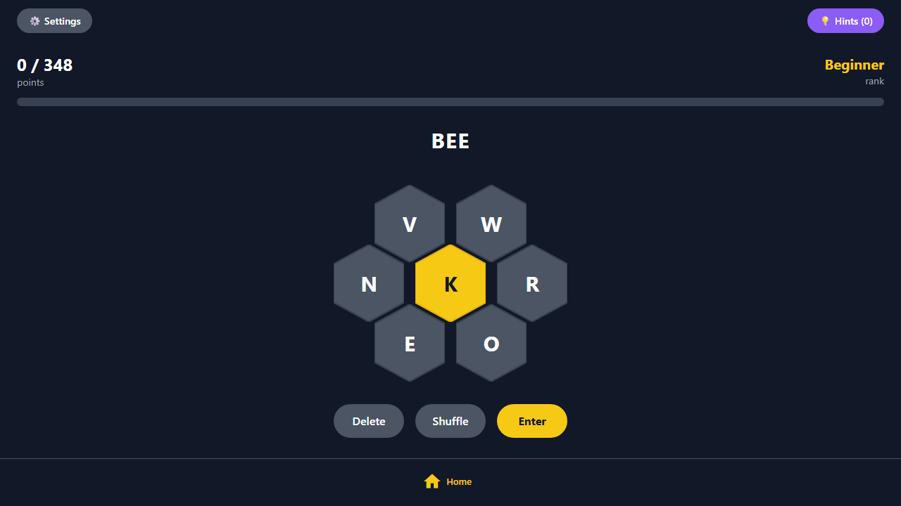
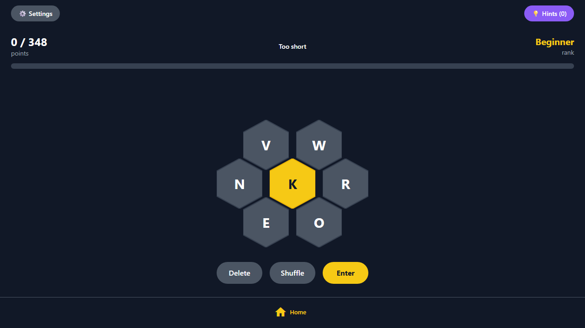
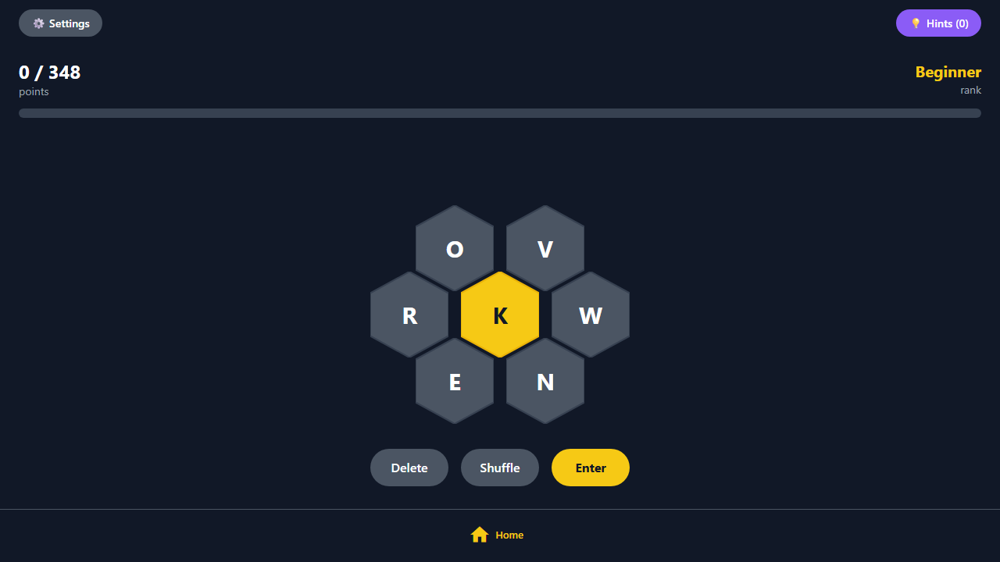
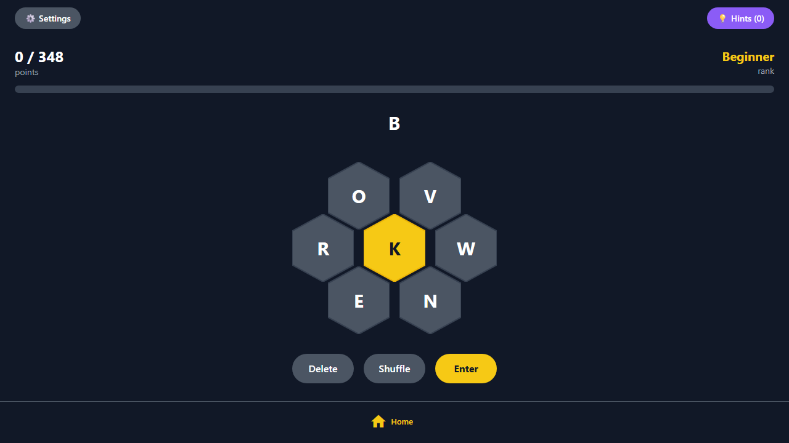
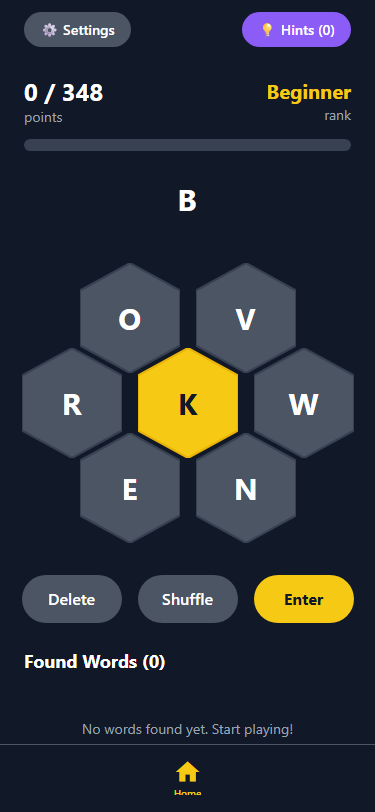

# Bee

Spelling Bee word game — puzzle generation with quality gates, 370K dictionary, 5 hint types. React Native + Expo, cross-platform.

| Main Screen | Keyboard Input | After Submit |
|:-----------:|:-------------:|:------------:|
|  |  |  |

## Why

I play Spelling Bee most mornings. At some point I wondered: how hard is it to generate a good puzzle? Turns out, harder than the game itself.

The generator picks 7 random letters (2–3 vowels, 4–5 consonants), designates one as the center letter, then filters a 370,000-word dictionary for valid 4+ letter words that include the center. Most random letter sets produce garbage — either 3 valid words or 400. The quality gates reject anything outside 20–80 valid words with at least one pangram. It takes up to 100 attempts to find a set that makes a good puzzle.

The hint system has five types: word length distribution, first letter reveal, definitions with rhymes, two-letter start patterns, and a difficulty meter splitting remaining words into common vs. tricky. Hints are earned by finding words — the rate scales with difficulty mode (Practice gives unlimited, Hard requires 3 words per hint).

Building it cross-platform with React Native taught me more about state management edge cases than any tutorial. Games are where platform differences stop being theoretical.

It's a word game. 80 tests for a word game. Same standards I'd apply to anything else.

### Demo

https://github.com/Cuuper22/Bee/raw/main/screenshots/0a6de9a8e792b6e58d68101c2300fed4.webm

## How It Works

You get 7 letters arranged in a honeycomb. One is the center letter — every word must include it. Find as many 4+ letter words as you can. Pangrams (using all 7 letters) give bonus points.

| Word | Points |
|------|--------|
| 4 letters | 1 |
| 5+ letters | 1 per letter |
| Pangram bonus | +7 |

10 ranks from Beginner (0%) to Queen Bee (100%).

## Features

- **Quality-gated puzzle generation** — up to 100 attempts per puzzle, must have 20–80 words and ≥1 pangram
- **370K+ word dictionary** — built from raw wordlist via Python pipeline (`scripts/build_dictionary.py` → `assets/dictionary.json`)
- **5 hint types** — word length table, first letter, definitions + rhymes, two-letter starts, difficulty meter
- **4 difficulty modes** — Practice (unlimited hints) → Easy (1:1) → Normal (2:1) → Hard (3:1 words per hint)
- **Persistent state** — AsyncStorage saves progress across sessions
- **Full keyboard support** — A-Z input, Enter (submit), Backspace (delete), Space (shuffle)
- **Haptic feedback** — native tactile response on mobile
- **Accessibility** — 44px+ touch targets, ARIA labels, screen reader text, keyboard navigation, high-contrast colors (16:1+ ratio on primary text)

## Architecture

Built on the [Manus](https://manus.app) platform scaffold (React Native + Expo + tRPC + Express). The `_core` directories are platform infrastructure — auth, OAuth, API layer.

**What I built:**

```
lib/
  game-logic.ts        — puzzle generation, scoring, validation (6.9KB)
  hint-system.ts       — 5 hint type generators (5.2KB)
  game-state.ts        — state management + difficulty modes (3.0KB)
  dictionary-service.ts — dictionary loading (2.1KB)
  __tests__/           — 80 tests across 9 files

scripts/
  build_dictionary.py  — Python: processes words_alpha.txt → dictionary.json

components/            — 18 game UI components (honeycomb grid, modals, score display)
app/(tabs)/index.tsx   — main game screen (13.2KB)
```

The dictionary pipeline is a Python script in a TypeScript project — because the right tool for text processing is the right tool, not the project's primary language.

## Tests

```bash
pnpm test
# 80 tests across 9 files
```

| File | Tests | What it covers |
|------|------:|---------------|
| game-logic.test.ts | 16 | Scoring, validation, ranks, pangram detection |
| hint-system.test.ts | 20 | All 5 hint generators + edge cases |
| game-state.test.ts | 14 | Initial state, hint earning across all 4 difficulty modes |
| puzzle-generation.test.ts | 4 | Quality gates, letter distribution, word filtering |
| keyboard-navigation.test.ts | 6 | Key mappings, special keys, modal state |
| accessibility.test.ts | 5 | Touch targets, labels, contrast, screen reader text |
| ui-components.test.ts | 5 | Message types, progress calc, animations, colors |
| performance.test.ts | 5 | Large list filtering, uniqueness, memoization |
| error-handling.test.ts | 5 | Null handling, type safety, array operations |

## More Screenshots

| After Shuffle | After Backspace | Mobile View |
|:------------:|:---------------:|:-----------:|
|  |  |  |

## Stack

React Native 0.81, Expo SDK 54, TypeScript 5.9, NativeWind (Tailwind), TanStack Query, Vitest, tRPC + Express, Drizzle ORM + SQLite

## Run It

```bash
pnpm install
pnpm dev
# Metro bundler on :8081 + Express backend
```

Web: `pnpm dev:metro` → localhost:8081
iOS: `pnpm ios`
Android: `pnpm android`

## See Also

- [Erdos](https://github.com/Cuuper22/Erdos) — same testing discipline applied to theorem proving
- [ToaruOS-Arnold](https://github.com/Cuuper22/ToaruOS-Arnold) — same "build it properly" approach applied to an entire OS

## License

MIT
